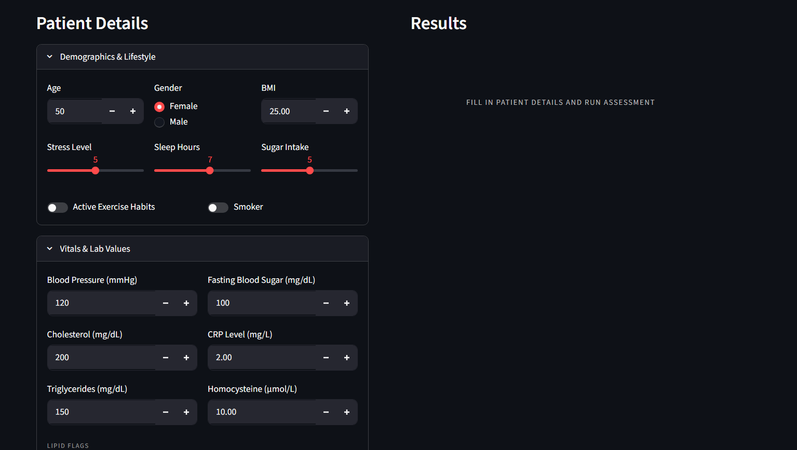
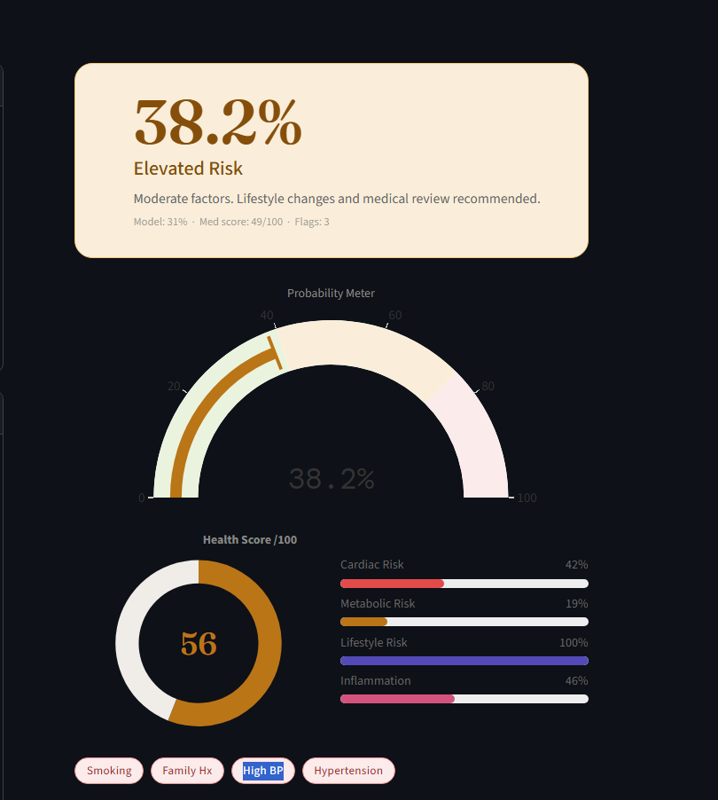
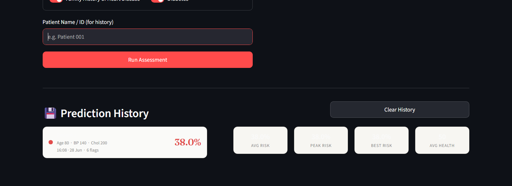

# ❤️ HeartGuard AI

<p align="center">
  
</p>

<p align="center">


</p>

<p align="center">

### **Intelligent Heart Disease Risk Assessment using Machine Learning**

*Predict • Analyze • Prevent*

</p>

---

## 📖 Overview

**HeartGuard AI** is an AI-powered heart disease risk assessment application built using **Python, Streamlit, and Scikit-learn**. It predicts cardiovascular disease risk using a trained Machine Learning model combined with a clinical risk scoring approach to provide more meaningful and interpretable results.

The application is designed with an intuitive interface, interactive visualizations, and personalized health recommendations, making it suitable for educational purposes and machine learning demonstrations.

> **Disclaimer:** This application is intended for educational and research purposes only and should not be used as a substitute for professional medical advice or diagnosis.

---

# ✨ Features

* ❤️ Machine Learning-based Heart Disease Prediction
* 📊 Hybrid Risk Assessment (ML + Clinical Risk Score)
* 📈 Interactive Health Dashboard
* 🎯 Personalized Health Recommendations
* ⚡ Real-time Predictions
* 📉 Probability-Based Risk Estimation
* 📋 Clean & Responsive Streamlit Interface
* 📁 Bulk Prediction Support
* 📊 Interactive Charts & Visualizations

---

# 🛠 Tech Stack

| Category            | Technology    |
| ------------------- | ------------- |
| Programming         | Python        |
| Frontend            | Streamlit     |
| Machine Learning    | Scikit-learn  |
| Data Processing     | Pandas, NumPy |
| Visualization       | Plotly        |
| Model Serialization | Joblib        |
| Styling             | Custom CSS    |

---

# 📂 Project Structure

```text
HeartGuard-AI
│
├── assets/
│   ├── banner.png
│   ├── logo.png
│   ├── demo.gif
│   └── screenshots/
│
├── data/
│   ├── heart_disease_dataset.csv
│   └── bulk_test.csv
│
├── model/
│   ├── heart_pipeline.pkl
│   └── heart_disease_model.pkl
│
├── notebook/
│   └── model_training.ipynb
│
├── styles/
│   └── styles.css
│
├── app.py
├── utils.py
├── requirements.txt
└── README.md
```

---

# 🧠 Machine Learning Workflow

```text
Patient Information
        │
        ▼
Data Preprocessing
        │
        ▼
Feature Engineering
        │
        ▼
Machine Learning Pipeline
        │
        ▼
Risk Probability
        │
        ▼
Clinical Risk Score
        │
        ▼
Final Risk Assessment
        │
        ▼
Personalized Recommendations
```

---

# 📊 Model Highlights

* End-to-End Scikit-learn Pipeline
* Feature Preprocessing
* Probability-based Prediction
* Clinical Risk Score Integration
* Cached Model Loading
* Real-time Inference

---
# 📸 Application Preview

<p align="center">
  
  
</p>

<p align="center">
  
</p>

---


---

# 🚀 Installation

### 1️⃣ Clone the Repository

```bash
git clone https://github.com/vaibhavjain9907/HeartGuard-AI.git
```

### 2️⃣ Navigate to the Project

```bash
cd HeartGuard-AI
```

### 3️⃣ Install Dependencies

```bash
pip install -r requirements.txt
```

### 4️⃣ Launch the Application

```bash
streamlit run app.py
```

---

# 🔮 Future Roadmap

* 🧠 Explainable AI with SHAP
* 📊 Enhanced Health Analytics
* 📈 Advanced Risk Visualizations
* 📄 PDF Health Report Generation
* ⚡ Model Performance Comparison
* 🎨 Improved User Experience
* ☁️ Cloud Deployment

---

# 👨‍💻 Author

## **Vaibhav Jain**

AI & Data Science Student

* 🐙 GitHub: https://github.com/vaibhavjain9907
* 💼 LinkedIn: https://www.linkedin.com/in/vaibhavjain990/

---

# ⭐ Support

If you found **HeartGuard AI** useful, consider giving this repository a ⭐.

It helps the project reach more developers and motivates future improvements.

---

<p align="center">

### ❤️ HeartGuard AI

**Predict • Analyze • Prevent**

Made with ❤️ using **Python • Streamlit • Scikit-Learn**

</p>
