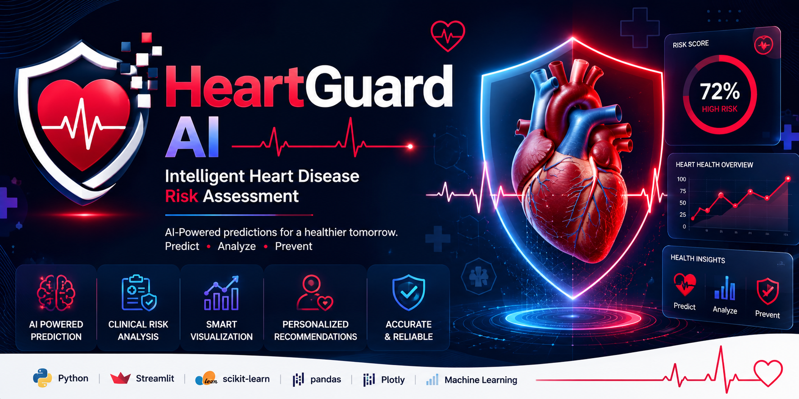

# ❤️ HeartGuard AI

<p align="center">
  
</p>

<p align="center">


</p>

<p align="center">

### **Intelligent Heart Disease Risk Assessment using Machine Learning**

*Predict • Analyze • Prevent*

</p>

---

## 📖 Overview

**HeartGuard AI** is an AI-powered heart disease risk assessment application built using **Python, Streamlit, and Scikit-learn**. It predicts cardiovascular disease risk using a trained Machine Learning model combined with a clinical risk scoring approach to provide more meaningful and interpretable results.

The application is designed with an intuitive interface, interactive visualizations, and personalized health recommendations, making it suitable for educational purposes and machine learning demonstrations.

> **Disclaimer:** This application is intended for educational and research purposes only and should not be used as a substitute for professional medical advice or diagnosis.

---

# ✨ Features

* ❤️ Machine Learning-based Heart Disease Prediction
* 📊 Hybrid Risk Assessment (ML + Clinical Risk Score)
* 📈 Interactive Health Dashboard
* 🎯 Personalized Health Recommendations
* ⚡ Real-time Predictions
* 📉 Probability-Based Risk Estimation
* 📋 Clean & Responsive Streamlit Interface
* 📁 Bulk Prediction Support
* 📊 Interactive Charts & Visualizations

---

# 🛠 Tech Stack

| Category            | Technology    |
| ------------------- | ------------- |
| Programming         | Python        |
| Frontend            | Streamlit     |
| Machine Learning    | Scikit-learn  |
| Data Processing     | Pandas, NumPy |
| Visualization       | Plotly        |
| Model Serialization | Joblib        |
| Styling             | Custom CSS    |

---

# 📂 Project Structure

```text
HeartGuard-AI
│
├── assets/
│   ├── banner.png
│   ├── logo.png
│   ├── demo.gif
│   └── screenshots/
│
├── data/
│   ├── heart_disease_dataset.csv
│   └── bulk_test.csv
│
├── model/
│   ├── heart_pipeline.pkl
│   └── heart_disease_model.pkl
│
├── notebook/
│   └── model_training.ipynb
│
├── styles/
│   └── styles.css
│
├── app.py
├── utils.py
├── requirements.txt
└── README.md
```

---

# 🧠 Machine Learning Workflow

```text
Patient Information
        │
        ▼
Data Preprocessing
        │
        ▼
Feature Engineering
        │
        ▼
Machine Learning Pipeline
        │
        ▼
Risk Probability
        │
        ▼
Clinical Risk Score
        │
        ▼
Final Risk Assessment
        │
        ▼
Personalized Recommendations
```

---

# 📊 Model Highlights

* End-to-End Scikit-learn Pipeline
* Feature Preprocessing
* Probability-based Prediction
* Clinical Risk Score Integration
* Cached Model Loading
* Real-time Inference

---

# 📷 Screenshots

## 🏠 Home Page

> *(Add screenshot here)*

```markdown
assets/screenshots/home.png
```

---

## 📊 Prediction Result

> *(Add screenshot here)*

```markdown
assets/screenshots/prediction.png
```

---

## 💡 Recommendations

> *(Add screenshot here)*

```markdown
assets/screenshots/recommendation.png
```

---

## 📈 Analytics Dashboard

> *(Add screenshot here)*

```markdown
assets/screenshots/analytics.png
```

---

# 🎥 Demo

> Add your application demo GIF here.

```markdown
assets/demo.gif
```

---

# 🚀 Installation

Clone the repository

```bash
git clone https://github.com/your-username/HeartGuard-AI.git
```

Move into the project directory

```bash
cd HeartGuard-AI
```

Install dependencies

```bash
pip install -r requirements.txt
```

Run the application

```bash
streamlit run app.py
```

---

# 📌 Future Improvements

* Explainable AI using SHAP
* Enhanced Health Analytics
* Improved Risk Visualizations
* Model Comparison Dashboard
* Advanced Medical Insights
* PDF Report Generation
* Better UI/UX

---

# 👨‍💻 Author

**Vaibhav Jain**

AI & Data Science Student

GitHub: https://github.com/vaibhavjain9907

LinkedIn: https://www.linkedin.com/in/vaibhavjain990/

---

# ⭐ Support

If you found this project helpful, consider giving it a ⭐ on GitHub. It helps others discover the project and motivates future improvements.

---

<p align="center">

**❤️ HeartGuard AI**

*Predict • Analyze • Prevent*

</p>
